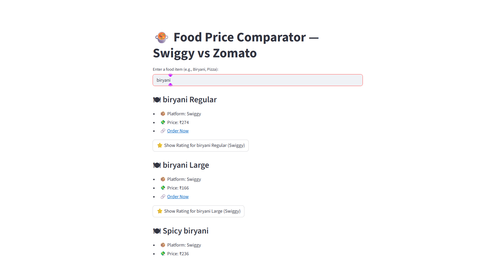
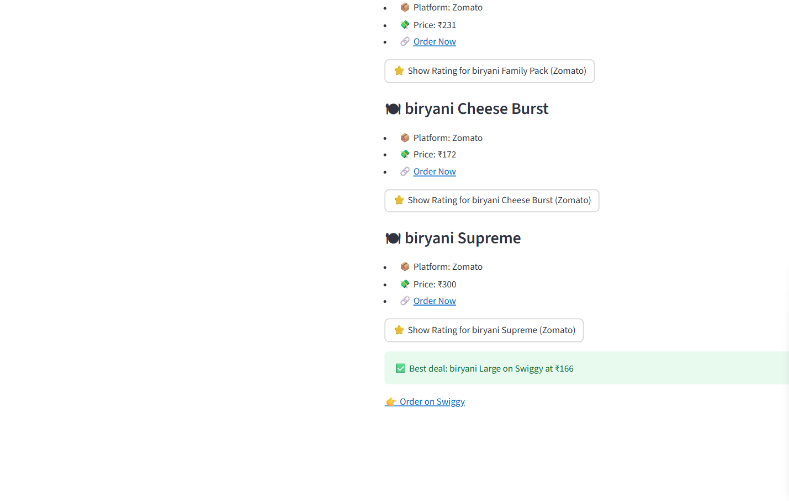

# 🍲 Swiggy vs Zomato Food Price Comparator

A fun and interactive **Streamlit web app** that lets you compare food prices between **Swiggy** and **Zomato**.  
Just enter a food item (like *Biryani, Pizza, Burger*) and the app will show you variations, prices, ratings, and the **best deal** 🔥

---

## ✨ Features

- 🔍 **Search Any Food Item** – Enter what you want to eat and get results.  
- 🍔 **Multiple Variations** – Regular, Large, Combo, Family Pack, etc.  
- 💸 **Price Comparison** – See which platform offers the cheapest option.  
- ⭐ **Random Ratings** – Simulated user ratings for fun.  
- 🔗 **Order Links** – Direct links to Swiggy & Zomato search results.  
- 🔥 **Today’s Special** – Highlights one item randomly.  
- ✅ **Best Deal Finder** – Automatically shows the lowest price option.  

---

## 🛠️ Tech Stack

- **Python** 🐍  
- **Streamlit** – For UI  
- **Pandas** – For handling data  
- **Random & Time** – For simulation  

---

## 🚀 How to Run Locally

1. Clone this repository:
   ```bash
   git clone https://github.com/Kavyame/swiggy-zomato-food-comparator.git
   cd swiggy-zomato-food-comparator
## Install dependencies:

pip install streamlit pandas


## Run the app:

streamlit run app.py


## Open in browser:

http://localhost:8501

## 📸 Demo Preview





## 📌 Future Improvements

✅ Connect to real Swiggy & Zomato APIs (instead of random prices).

✅ Add filtering (Veg/Non-Veg, Price range).

✅ Deploy on Streamlit Cloud or Render for live access.

## 🤝 Contributing

Feel free to fork, improve, and make pull requests 🙌

## 🧑‍💻 Author

Developed by Dutta Kavya and Teammates 
📧 duttakavya18@gmail.com
